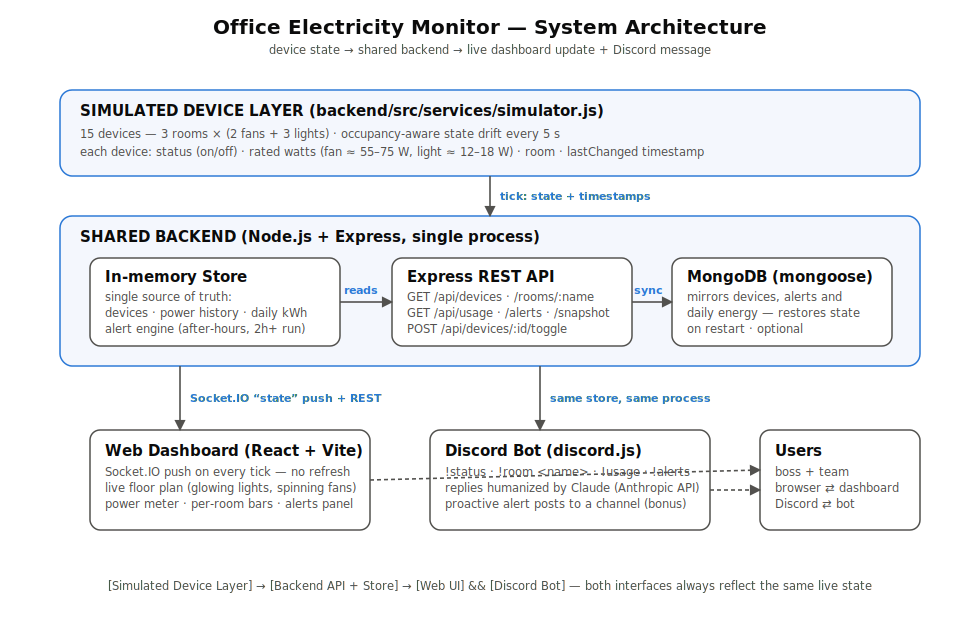

# 💡 Lights, Fans, Discord — Office Electricity Monitor

A live monitoring system for a small office: a **real-time web dashboard** and
a **Discord bot** that both read from **one shared backend**, showing the
on/off state and power draw of every fan and light across three rooms.

Built for the Techathon Nationals preliminary round ("Lights, Fans, Discord:
The Boss's Big Idea").



## What's inside

| Layer | Tech | Where |
|---|---|---|
| Simulated device layer | Node.js timer, occupancy-aware model | `backend/src/services/simulator.js` |
| Single source of truth | In-memory store + optional MongoDB mirror | `backend/src/state/store.js`, `backend/src/services/persistence.js` |
| REST API + realtime feed | Express + Socket.IO | `backend/src/routes/api.js`, `backend/src/server.js` |
| Alert engine | after-hours + 2h-continuous rules | `backend/src/services/alerts.js` |
| Web dashboard | React 18 + Vite, live floor plan | `frontend/` |
| Discord bot | discord.js v14, Claude-humanized replies | `backend/src/bot/` |
| Diagrams | system diagram + hardware schematic guide | `docs/` |

**Device model.** The office has 3 rooms (Drawing Room, Work Room 1, Work
Room 2), each with 2 fans and 3 lights — **15 devices total** (the brief's
floor plan confirms: 6 fans + 9 lights). Every device tracks `status`,
rated `watts` (fans ≈ 55–75 W, lights ≈ 12–18 W), `room` and a `lastChanged`
timestamp. The simulator drifts states every 5 s using per-room occupancy
profiles that respect office hours (9 AM–5 PM), so after-hours "forgotten
devices" occur naturally and trigger alerts.

## Quick start

Prerequisites: **Node.js ≥ 20**. MongoDB, a Discord token and an Anthropic
key are all *optional* — the system runs fully without them.

> Node's per-project `node_modules` is the isolated environment here (the
> Node equivalent of a Python virtualenv) — dependencies never install
> globally.

```bash
# 1. Backend (API + simulator + bot) — http://localhost:4000
cd backend
npm install
cp .env.example .env        # optional: fill in Mongo/Discord/Anthropic
npm start

# 2. Frontend (dashboard) — http://localhost:5173
cd ../frontend
npm install
npm run dev
```

Open http://localhost:5173 — the floor plan, power meter and alerts update
live over Socket.IO (no page refresh). Click any device row to toggle it
manually and watch every panel react.

### MongoDB (optional persistence)

Set `MONGODB_URI` in `backend/.env` (default
`mongodb://127.0.0.1:27017/office-monitor`). When reachable, device states,
alerts and today's kWh are mirrored to Mongo and restored on restart. When
not, the backend logs a warning and continues in-memory — the demo never
blocks on a database.

### Discord bot

1. Create an application + bot at https://discord.com/developers/applications,
   enable the **Message Content Intent**, and invite it to your server with
   the *Send Messages* + *Read Message History* permissions.
2. Put the token in `backend/.env` as `DISCORD_BOT_TOKEN`.
3. (Bonus) set `DISCORD_ALERT_CHANNEL_ID` to a channel ID — the bot posts
   proactively whenever a new alert triggers.
4. (Recommended) set `ANTHROPIC_API_KEY` — replies are phrased
   conversationally by Claude from *verified live data* (facts are computed
   from the store and passed to the model; it only does the wording).
   Without a key the bot falls back to friendly built-in templates.

| Command | What it does |
|---|---|
| `!status` | Whole office, room by room — e.g. "Drawing Room: 1 fan ON, 2 lights ON…" |
| `!room <name>` | One room in detail (`!room work1`, `!room drawing`) |
| `!usage` | "Total power right now: 740 W. Today's estimated usage: 4.2 kWh." |
| `!alerts` | Currently active anomalies |
| `!help` | Command list |

## API reference

| Endpoint | Description |
|---|---|
| `GET /api/health` | Uptime, Mongo status |
| `GET /api/devices` | All 15 devices |
| `POST /api/devices/:id/toggle` | Manual override (demo) |
| `GET /api/rooms` / `GET /api/rooms/:name` | Per-room summaries |
| `GET /api/usage` | Live watts, per-room breakdown, today's kWh, history |
| `GET /api/alerts?active=true` | Timestamped alerts |
| `GET /api/snapshot` | Everything at once (dashboard bootstrap) |

Socket.IO: clients receive a full `state` snapshot on connect and after every
simulator tick.

## Alerts

1. **After-hours** — any devices ON outside 9 AM–5 PM (aggregated per room).
2. **Long-running** — every device in a room ON continuously for over 2 hours.

Alerts are timestamped, de-duplicated, auto-resolved when the condition
clears, shown on the dashboard, queryable via `!alerts`, and (bonus) pushed
proactively to a Discord channel.

## Architecture

One process, one store: the simulator mutates the in-memory store; Express,
Socket.IO and the Discord bot all read the same object, so the dashboard and
the bot can never disagree. MongoDB mirrors the store asynchronously for
persistence. See [docs/system-diagram.svg](docs/system-diagram.svg) and the
hardware design for a real deployment in
[docs/hardware-schematic.md](docs/hardware-schematic.md) (ESP32 per room,
opto-isolated on/off sensing + CT-clamp current measurement — pin mapping and
connection list included for building the Wokwi schematic).

## Project structure

```
backend/
  src/
    server.js            entry point - wires everything together
    state/store.js       single source of truth (EventEmitter)
    services/
      simulator.js       simulated device layer
      alerts.js          alert rules
      persistence.js     optional MongoDB mirror
    routes/api.js        REST endpoints
    bot/
      index.js           Discord commands + proactive alerts
      humanizer.js       Claude-powered conversational replies
frontend/
  src/
    App.jsx              page layout
    hooks/useLiveState.js  Socket.IO subscription
    components/          Header, StatTiles, OfficeMap, PowerPanel,
                         AlertsPanel, RoomPanel
docs/
  system-diagram.svg     high-level architecture (no Mermaid)
  hardware-schematic.md  ESP32 sensing circuit - pin maps + reasoning
```
